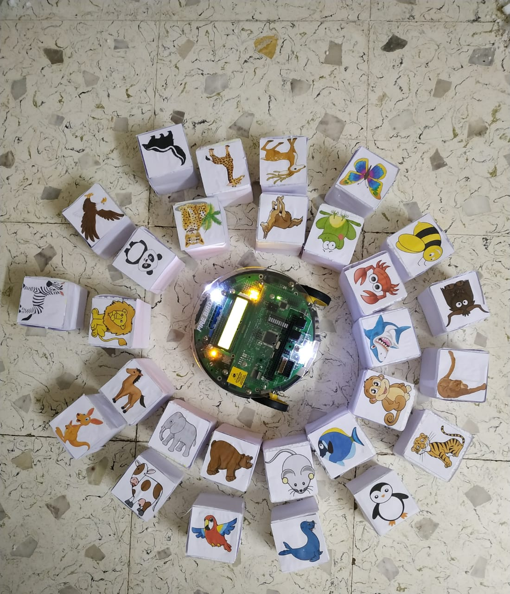
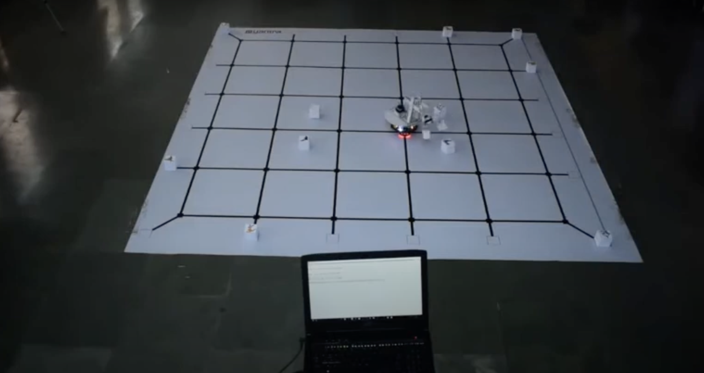
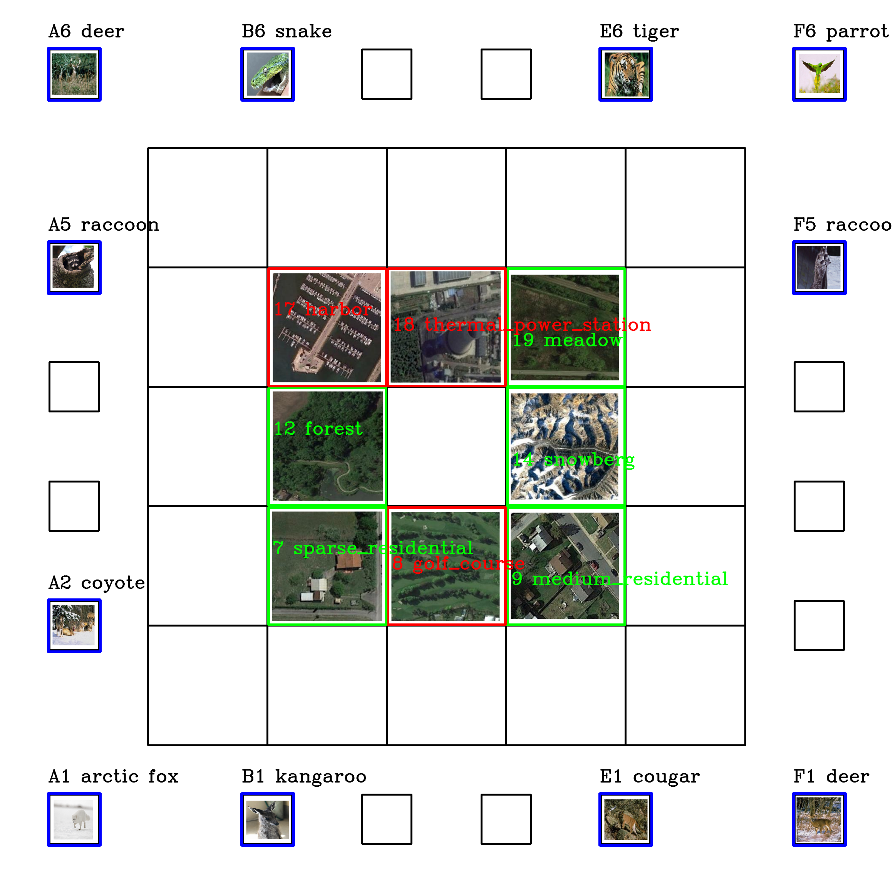
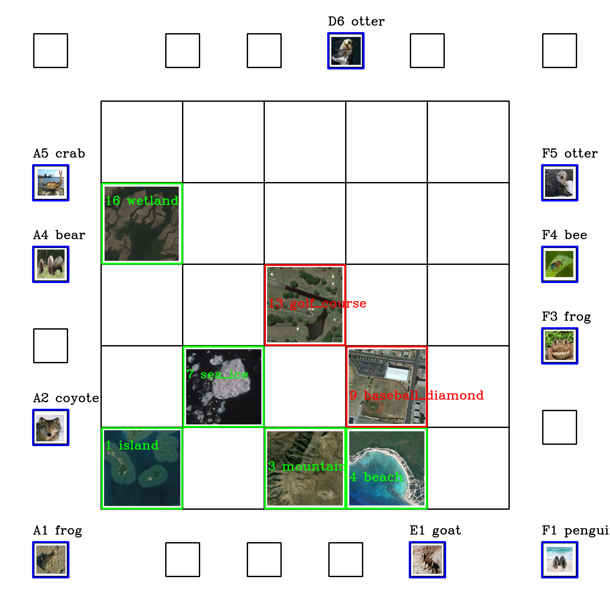
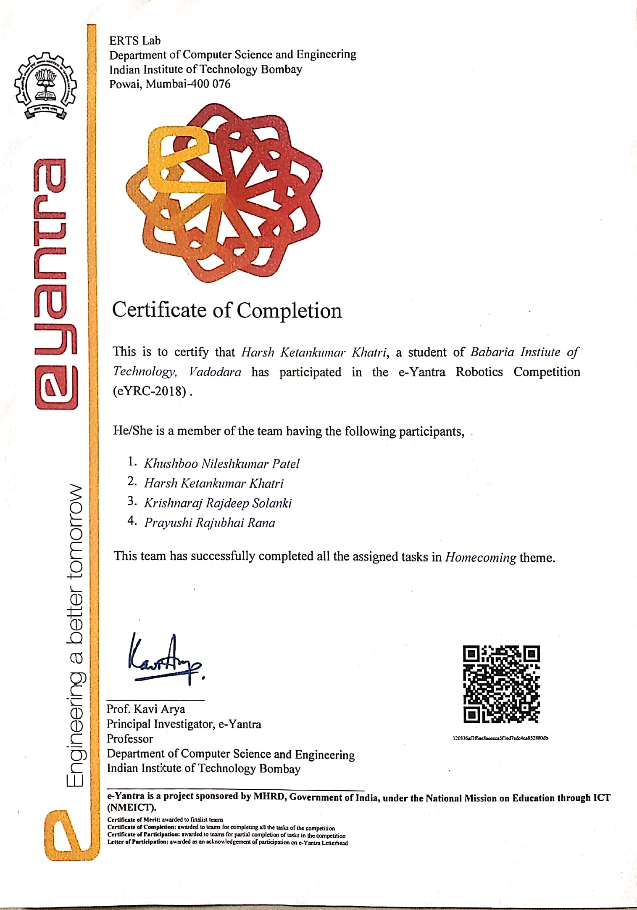

# 🌟 Semifinalist - E-Yantra Robotics Competition 2018 | Homecoming | Top 10

## 🎯 Theme: Homecoming (HC)

The **Indian subcontinent** is home to a diverse range of wildlife, from **Bengal and Indochinese tigers** to various species of **Deer (Chital, Hangul, Barasingha)**. With **120 national parks, 18 bio-reserves, and over 500 wildlife sanctuaries**, India is one of the most biodiverse regions in the world.

Inspired by this, the **e-Yantra Robotics Competition (eYRC-2018)** introduced the theme **"Homecoming"**, challenging participants to build an autonomous robot capable of recognizing and sorting animals into their respective habitats.

---

## 🤖 Project Overview

- **Autonomous Navigation** – The robot navigates through a grid-based ecosystem representing various animal habitats.  
- **Machine Learning Integration** – Identification of animals and their habitats using **Machine Learning algorithms**.  
- **Pick-and-Place Mechanism** – The robot picks up identified animals and places them in their correct habitat.  
- **Sensor-Based Path Traversal** – Implemented sensor-based movement for accurate navigation across the arena.  
- **Optimization Challenge** – The competition focused on completing the task in the shortest time with minimal penalties.  

---

## 🛠️ Technologies & Tools Used

- 🖥 **Machine Learning** for animal and habitat recognition  
- 🔌 **Embedded Systems Programming** for autonomous control  
- 🛣 **Sensor Interfacing** for path traversal and object detection  
- 🤖 **Pick-and-Place Mechanism Design** for precision handling  
- 🔍 **Fire Bird V Robot** as the autonomous hardware platform  

---

## 🎖️ Achievements

✅ **Ranked Among the Semifinalists** in the **National e-Yantra Robotics Competition 2018**  
✅ Successfully implemented an end-to-end autonomous system for animal recognition and sorting  
✅ Overcame real-world robotics challenges, including navigation, object manipulation, and sensor-based decision-making  

---

## 🎥 YouTube Video Demo  

## 🖼️ Image Gallery  

  
  
  
   
  
  
  

